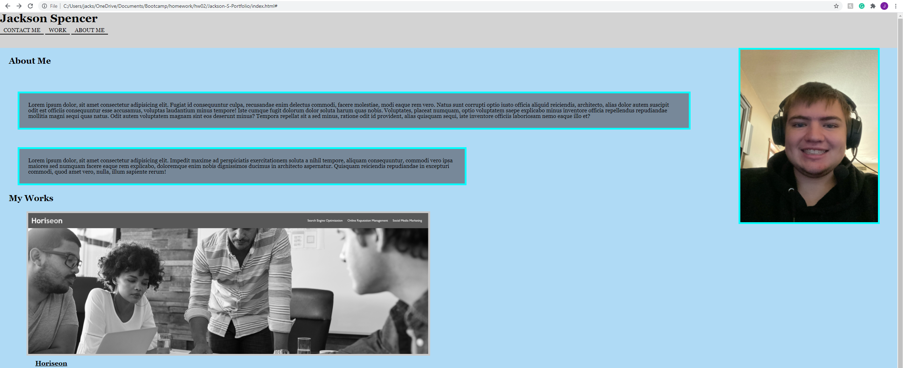

# Jackson-S-Portfolio
for this assignment, we had to make a website outlining a portfolio for us. On the website, it had to have links to secitons of the page,an about me section, a work section linking pictures to websites, and a contact section with my information for contact. As well as this, we had to add media queries so that the website adjusted images to fit the devices of other people. I added some effects to the images, such as increasing picture size, and removing a grayscale on the picture links.

# Screenshot

# Link to page
here is a link to the website: <link>https://j-spencer11.github.io/Jackson-S-Portfolio/</link>

here is a link to the repo: <link>https://github.com/j-spencer11/Jackson-S-Portfolio</link>